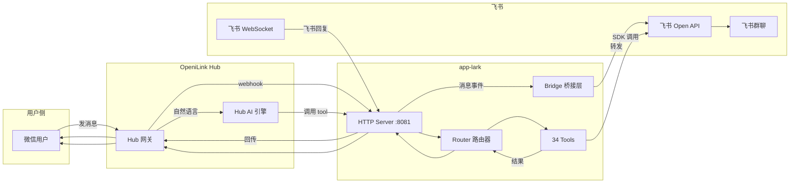

# @openilink/app-lark

[](./LICENSE)
[](https://nodejs.org/)
[](https://www.typescriptlang.org/)

**OpeniLink Hub App** -- 微信 ↔ 飞书双向消息桥接 + 飞书全平台 AI Tools（11 大业务域，34 个工具），供 Hub AI 自然语言调用。

---

## 功能特性

### IM 桥接

- 微信消息自动转发到飞书群聊，飞书回复自动回传微信
- 支持文本、图片等多种消息类型
- 基于 SQLite 持久化安装信息和消息映射关系

### 自然语言操作飞书

- Hub AI 自动收集本 App 注册的所有 Tools
- 用户在微信中以自然语言描述需求（如"帮我查一下今天的日程"）
- Hub AI 理解语义后自动调用对应的飞书 Tool，将结果返回给用户

### 11 大业务域覆盖

即时通讯、日历、云文档、任务、通讯录、云空间、多维表格、电子表格、邮箱、知识库、视频会议 -- 共 34 个 Tools，全面覆盖飞书办公场景。

### WebSocket 实时事件

基于飞书官方 Node SDK 的 WebSocket 长连接，实时接收飞书侧消息事件，无需配置公网回调地址。

---

## 架构图



---

## 快速开始

### 环境要求

- Node.js >= 20.0.0
- npm >= 9

### 安装依赖

```bash
git clone <repo-url> && cd openilink-app-lark
npm install
```

### 配置飞书应用

1. 登录 [飞书开发者后台](https://open.feishu.cn/app)，创建一个**企业自建应用**
2. 获取 **App ID** 和 **App Secret**
3. 在「事件订阅」页面，连接方式选择 **WebSocket 长连接**
4. 在「权限管理」中添加所需权限（参见[飞书应用配置指南](#飞书应用配置指南)）
5. 发布应用并审批通过

### 配置环境变量

```bash
cp .env.example .env
# 编辑 .env 填入你的配置
```

或直接导出环境变量：

```bash
export HUB_URL="https://your-hub.example.com"
export BASE_URL="https://your-app.example.com"
export LARK_APP_ID="cli_xxxxxxxxxxxxxxxx"
export LARK_APP_SECRET="xxxxxxxxxxxxxxxxxxxxxxxxxxxxxxxx"
export LARK_CHAT_ID="oc_xxxxxxxxxxxxxxxxxxxxxxxxxxxxxxxx"
```

### 启动

**开发模式（热重载）：**

```bash
npm run dev
```

**生产模式：**

```bash
npm run build
npm start
```

### Docker 部署

```bash
# 直接构建并启动
docker compose up -d

# 或单独构建镜像
docker build -t openilink-app-lark .
docker run -d \
  -p 8081:8081 \
  -e HUB_URL="https://your-hub.example.com" \
  -e BASE_URL="https://your-app.example.com" \
  -e LARK_APP_ID="cli_xxx" \
  -e LARK_APP_SECRET="xxx" \
  -e LARK_CHAT_ID="oc_xxx" \
  -v app-data:/data \
  openilink-app-lark
```

---

## 环境变量

| 变量名 | 必填 | 默认值 | 说明 |
|---|---|---|---|
| `PORT` | 否 | `8081` | HTTP 服务监听端口 |
| `HUB_URL` | **是** | - | OpeniLink Hub 网关地址 |
| `BASE_URL` | 否 | - | 本 App 的公网可访问地址（用于 OAuth 回调和 Webhook） |
| `DB_PATH` | 否 | `data/lark.db` | SQLite 数据库文件路径 |
| `LARK_APP_ID` | **是** | - | 飞书企业自建应用的 App ID |
| `LARK_APP_SECRET` | **是** | - | 飞书企业自建应用的 App Secret |
| `LARK_CHAT_ID` | 否 | - | 默认转发目标飞书群的 Chat ID |

---

## 支持的 Tools

共 **34 个工具**，覆盖飞书 **11 大业务域**。Hub AI 会自动收集这些 Tools 的定义，用户可以通过自然语言调用。

### 即时通讯 (IM)

| 工具名 | 命令 | 说明 |
|---|---|---|
| send_lark_message | `send_lark_message` | 发送飞书消息到群聊或私聊 |
| reply_lark_message | `reply_lark_message` | 回复飞书消息 |
| list_chat_messages | `list_chat_messages` | 查看群聊的消息列表 |
| search_messages | `search_messages` | 搜索飞书消息 |
| create_chat | `create_chat` | 创建飞书群聊 |
| search_chat | `search_chat` | 搜索飞书群聊 |
| get_chat_info | `get_chat_info` | 获取群聊详细信息 |

### 日历 (Calendar)

| 工具名 | 命令 | 说明 |
|---|---|---|
| list_calendar_events | `list_calendar_events` | 查看日历日程/议程列表 |
| create_calendar_event | `create_calendar_event` | 创建日历日程 |
| get_free_busy | `get_free_busy` | 查看用户忙闲状态 |

### 云文档 (Doc)

| 工具名 | 命令 | 说明 |
|---|---|---|
| create_doc | `create_doc` | 创建飞书云文档 |
| read_doc | `read_doc` | 读取飞书云文档内容 |
| search_doc | `search_doc` | 搜索飞书云文档 |

### 任务 (Task)

| 工具名 | 命令 | 说明 |
|---|---|---|
| create_task | `create_task` | 创建飞书任务 |
| list_tasks | `list_tasks` | 查看飞书任务列表 |
| complete_task | `complete_task` | 完成飞书任务 |

### 通讯录 (Contact)

| 工具名 | 命令 | 说明 |
|---|---|---|
| search_contact | `search_contact` | 搜索飞书联系人（支持姓名、邮箱、手机号） |
| get_user_info | `get_user_info` | 获取飞书用户详细信息 |

### 云空间 (Drive)

| 工具名 | 命令 | 说明 |
|---|---|---|
| search_files | `/search_files` | 搜索飞书云空间中的文件 |
| upload_file | `/upload_file` | 上传文件到飞书云空间 |
| get_file_info | `/get_file_info` | 获取飞书云空间文件的详细信息 |

### 多维表格 (Base)

| 工具名 | 命令 | 说明 |
|---|---|---|
| list_base_records | `/list_base_records` | 查看飞书多维表格中的记录 |
| create_base_record | `/create_base_record` | 在飞书多维表格中创建一条记录 |
| update_base_record | `/update_base_record` | 更新飞书多维表格中的一条记录 |

### 电子表格 (Sheets)

| 工具名 | 命令 | 说明 |
|---|---|---|
| read_sheet | `/read_sheet` | 读取飞书电子表格指定范围的数据 |
| write_sheet | `/write_sheet` | 向飞书电子表格指定范围写入数据 |
| append_sheet | `/append_sheet` | 向飞书电子表格追加数据 |

### 邮箱 (Mail)

| 工具名 | 命令 | 说明 |
|---|---|---|
| list_mails | `/list_mails` | 查看飞书邮箱中的最新邮件 |
| send_mail | `/send_mail` | 通过飞书邮箱发送邮件 |
| search_mail | `/search_mail` | 搜索飞书邮箱中的邮件 |

### 知识库 (Wiki)

| 工具名 | 命令 | 说明 |
|---|---|---|
| search_wiki | `/search_wiki` | 搜索飞书知识库中的文档 |
| get_wiki_node | `/get_wiki_node` | 读取飞书知识库中的节点内容 |

### 视频会议 (VC)

| 工具名 | 命令 | 说明 |
|---|---|---|
| list_meetings | `/list_meetings` | 查看飞书视频会议记录 |
| get_meeting_summary | `/get_meeting_summary` | 获取飞书视频会议的纪要内容 |

---

## 消息流转

本应用支持三种交互模式，满足不同使用场景：

### 模式一：自动桥接

微信与飞书之间的消息自动双向转发，无需人工干预。

```
微信用户发消息
  → Hub 推送 webhook（message.* 事件）
    → app-lark 接收并通过 WxToLark 桥接模块处理
      → 调用飞书 IM API 发送到指定群聊（LARK_CHAT_ID）

飞书群内回复
  → 飞书 WebSocket 长连接推送事件
    → app-lark 接收并回传给 Hub
      → Hub 将消息投递回微信用户
```

### 模式二：自然语言调用

用户以自然语言描述需求，Hub AI 自动识别意图并调用对应的飞书 Tool。

```
用户: "帮我查一下本周的日程安排"
  → Hub AI 理解语义
    → 调用 list_calendar_events 工具
      → 飞书日历 API 返回日程数据
        → 格式化后返回给用户

用户: "给张三发条飞书消息，告诉他明天开会"
  → Hub AI 理解语义
    → 先调用 search_contact 找到张三的 open_id
    → 再调用 send_lark_message 发送消息
      → 返回发送结果
```

### 模式三：命令调用

Hub 发送 `command` 事件，直接路由到对应 Tool 的 handler 执行。

```
Hub 推送 command 事件（如 send_lark_message）
  → Router 根据命令名匹配 handler
    → handler 解析参数并调用飞书 SDK
      → 将执行结果通过 HubClient 回复给用户
```

---

## 开发

### 常用命令

```bash
# 开发模式（使用 tsx 热重载）
npm run dev

# 编译 TypeScript
npm run build

# 生产环境运行
npm start

# 运行测试
npm test

# 监听模式运行测试
npm run test:watch
```

### 项目结构

```
src/
├── index.ts              # 主入口 - HTTP 服务器 & 飞书事件订阅
├── config.ts             # 环境变量配置加载
├── store.ts              # SQLite 数据持久化
├── router.ts             # 命令路由器
├── bridge/
│   ├── wx-to-lark.ts     # 微信 → 飞书 消息桥接
│   └── lark-to-wx.ts     # 飞书 → 微信 消息桥接
├── hub/
│   ├── client.ts         # Hub API 客户端
│   ├── manifest.ts       # App Manifest 生成
│   ├── oauth.ts          # OAuth 安装流程
│   ├── webhook.ts        # Hub Webhook 处理
│   └── types.ts          # Hub 类型定义
├── lark/
│   ├── client.ts         # 飞书 SDK 客户端封装
│   └── event.ts          # 飞书 WebSocket 事件订阅
├── tools/
│   ├── index.ts          # Tool 注册中心
│   ├── im.ts             # 即时通讯（7 tools）
│   ├── calendar.ts       # 日历（3 tools）
│   ├── doc.ts            # 云文档（3 tools）
│   ├── task.ts           # 任务（3 tools）
│   ├── contact.ts        # 通讯录（2 tools）
│   ├── drive.ts          # 云空间（3 tools）
│   ├── base.ts           # 多维表格（3 tools）
│   ├── sheets.ts         # 电子表格（3 tools）
│   ├── mail.ts           # 邮箱（3 tools）
│   ├── wiki.ts           # 知识库（2 tools）
│   └── vc.ts             # 视频会议（2 tools）
└── utils/
    └── crypto.ts         # 加密工具
```

### HTTP 端点

| 方法 | 路径 | 说明 |
|---|---|---|
| POST | `/hub/webhook` | Hub 事件推送入口（消息事件 + 命令事件） |
| GET | `/oauth/setup` | OAuth 安装流程发起 |
| GET | `/oauth/redirect` | OAuth 回调处理 |
| GET | `/manifest.json` | App Manifest（包含所有 Tool 定义） |
| GET | `/health` | 健康检查 |

---

## 飞书应用配置指南

### 第一步：创建应用

1. 前往 [飞书开发者后台](https://open.feishu.cn/app)
2. 点击「创建企业自建应用」
3. 填写应用名称（如"OpeniLink Bridge"）和描述
4. 记录 **App ID** 和 **App Secret**

### 第二步：配置机器人能力

1. 在应用管理页面，进入「添加应用能力」
2. 开启「机器人」能力

### 第三步：配置事件订阅

1. 进入「事件订阅」配置页面
2. 连接方式选择 **「使用长连接接收事件」**（WebSocket 模式，无需公网 IP）
3. 添加以下事件：
   - `im.message.receive_v1` -- 接收消息事件

### 第四步：添加权限

在「权限管理」页面，根据需要使用的功能添加对应权限：

**基础权限（必选）：**

| 权限标识 | 说明 |
|---|---|
| `im:message` | 获取与发送单聊、群组消息 |
| `im:message:send_as_bot` | 以应用的身份发送消息 |
| `im:chat` | 获取群组信息 |
| `im:chat:create` | 创建群组 |

**日历权限：**

| 权限标识 | 说明 |
|---|---|
| `calendar:calendar` | 查看和管理日历 |
| `calendar:calendar.event:write` | 创建和修改日程 |

**通讯录权限：**

| 权限标识 | 说明 |
|---|---|
| `contact:user.employee_id:readonly` | 获取用户 employee_id |
| `contact:user.base:readonly` | 获取用户基本信息 |

**云文档 / 云空间权限：**

| 权限标识 | 说明 |
|---|---|
| `docs:doc` | 查看和管理云文档 |
| `drive:drive` | 查看和管理云空间文件 |
| `sheets:spreadsheet` | 查看和管理电子表格 |
| `bitable:app` | 查看和管理多维表格 |
| `wiki:wiki` | 查看和管理知识库 |

**其他权限：**

| 权限标识 | 说明 |
|---|---|
| `mail:user_mailbox` | 查看和管理用户邮箱 |
| `vc:meeting` | 查看视频会议信息 |
| `task:task` | 查看和管理任务 |

### 第五步：发布应用

1. 在应用管理页面点击「创建版本」
2. 填写版本信息后提交审核
3. 管理员在飞书管理后台审批通过即可使用

### 第六步：获取群聊 ID

如需将微信消息自动转发到指定飞书群，需要获取群聊 Chat ID：

1. 将机器人添加到目标群聊
2. 在群聊中 @机器人 发送任意消息，从 WebSocket 事件日志中获取 `chat_id`
3. 将其配置为 `LARK_CHAT_ID` 环境变量

---

## 安全与隐私

### 数据处理说明

- **消息内容不落盘**：本 App 在转发消息时，消息内容仅在内存中中转，**不会存储到数据库或磁盘**
- **仅保存消息 ID 映射**：数据库中只保存消息 ID 的对应关系（用于回复路由），不保存消息正文
- **用户数据严格隔离**：所有数据库查询均按 `installation_id` + `user_id` 双重过滤，不同用户之间完全隔离，无法互相访问

### 应用市场安装（托管模式）

通过 OpeniLink Hub 应用市场一键安装时，消息将通过我们的服务器中转。我们承诺：

- 不会记录、存储或分析用户的消息内容
- 不会将用户数据用于任何第三方用途
- 所有 App 代码完全开源，接受社区审查
- 我们会对每个上架的 App 进行严格的安全审查

### 自部署（推荐注重隐私的用户）

如果您对数据隐私有更高要求，建议自行部署本 App：

```bash
# Docker 部署
docker compose up -d

# 或源码运行
npm install && npm run build && npm start
```

自部署后所有数据仅在您自己的服务器上流转，不经过任何第三方。

## License

[MIT](./LICENSE)
